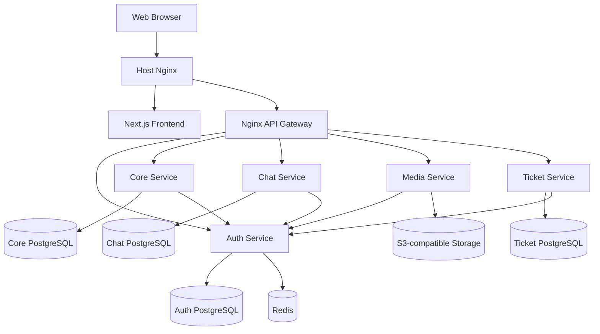

# Digche

Digche is a collaborative, microservices-based marketplace for discovering, ordering, and selling homemade food.

The platform combines a Next.js frontend with independently deployable backend services for authentication, food ordering, realtime chat, media uploads, and support tickets.

The name **Digche** is inspired by the Persian word **دیگچه**, reflecting the project's connection to homemade food and local cuisine.

## Highlights

- Customer, chef, admin, and manager experiences
- OTP-based authentication with access and refresh tokens
- Dish discovery and management
- Shopping cart and order lifecycle
- Comments and chef dashboard
- Realtime chat over WebSocket
- Presigned uploads to S3-compatible object storage
- Support ticket workflow
- Database-per-service persistence
- Nginx API gateway
- Docker Compose orchestration
- Production deployment with GitHub Actions

## Architecture



For the full system description, see [Architecture Overview](docs/architecture/overview.md).

## Tech Stack

| Area | Technologies |
| --- | --- |
| Frontend | Next.js 16, React 19, TypeScript, Tailwind CSS 4, Zustand |
| Core Service | .NET 9, ASP.NET Core, MediatR, Entity Framework Core, PostgreSQL |
| Auth | Node.js, Express, Sequelize, PostgreSQL, Redis, JWT |
| Chat | Node.js, Fastify, WebSocket, Sequelize, PostgreSQL |
| Media | Node.js, Express, AWS S3 SDK |
| Ticket | Node.js, Express, Sequelize, PostgreSQL |
| Infrastructure | Docker, Docker Compose, Nginx, PM2, GitHub Actions |
| API Documentation | OpenAPI 3.0, Swagger UI |

## Services

| Service | Responsibility |
| --- | --- |
| Auth | Authentication, OTP, sessions, roles, profiles, internal identity APIs |
| Core | Dishes, carts, orders, comments, and chef dashboard |
| Chat | Conversations, messages, unread state, and realtime events |
| Media | Presigned profile and dish image uploads |
| Ticket | User support tickets and administrative replies |
| API Gateway | Routing, rate limiting, and WebSocket proxying |

## My Contribution

Digche was developed collaboratively by a team. My primary contribution focused on the **Core Service**:

```text
Backend/services/core/FoodOrdering
```

My work in the Core Service included:

- domain models for dishes, carts, orders, order items, and comments;
- application use cases implemented with MediatR commands, queries, and handlers;
- dish management and availability flows;
- shopping cart operations;
- order creation, retrieval, chef/customer order flows, and order status handling;
- comment flows and chef dashboard data;
- repository abstractions and Entity Framework Core repository implementations;
- PostgreSQL persistence and database migrations;
- ASP.NET Core controllers and service configuration;
- integration between the Core Service and the authentication service;
- Docker setup for the Core Service.

For the internal design and request flow, see [Core Service Documentation](docs/services/core.md).

The rest of the platform was developed collaboratively by other team members. The original Git history is preserved so contributions remain attributable to their original authors.

## Project Structure

```text
.
├── frontend/                         # Next.js web application
├── Backend/
│   ├── gateway/                      # Nginx API gateway
│   ├── docs/api/                     # OpenAPI specifications
│   ├── scripts/                      # Operational scripts
│   └── services/
│       ├── auth/
│       ├── chat/
│       ├── core/
│       │   └── FoodOrdering/
│       │       ├── FoodOrdering.Core.API/
│       │       ├── FoodOrdering.Core.Application/
│       │       ├── FoodOrdering.Core.Domain/
│       │       ├── FoodOrdering.Core.Infrastructure/
│       │       └── FoodOrdering.Core.Tests/
│       ├── media/
│       └── ticket/
├── deploy/
│   └── nginx/
├── docs/
└── .github/
```

## Getting Started

### Prerequisites

- Docker and Docker Compose
- Node.js
- npm
- .NET 9 SDK if running the Core Service outside Docker

### Backend

```bash
cd Backend

cp services/auth/.env.example services/auth/.env
cp services/chat/.env.example services/chat/.env
cp services/media/.env.example services/media/.env
cp services/ticket/.env.example services/ticket/.env
```

Create `Backend/.env` with the shared database passwords, JWT secret, and internal authentication key required by Docker Compose.

Then start the backend:

```bash
docker compose up -d --build
```

Local API gateway:

```text
http://localhost:8081
```

### Frontend

```bash
cd frontend
npm ci
npm run dev
```

Example local configuration:

```env
NEXT_PUBLIC_API_BASE_URL=http://localhost:8081
NEXT_BACKEND_API_BASE_URL=http://localhost:8081
```

Frontend:

```text
http://localhost:3000
```

See [Getting Started](docs/development/getting-started.md) for the complete local setup.

## API Documentation

OpenAPI definitions:

```text
Backend/docs/api/
├── auth.openapi.yaml
├── chat.openapi.yaml
├── media.openapi.yaml
└── ticket.openapi.yaml
```

Development Swagger endpoints are available for the Node.js services when Swagger is enabled.

See [API Documentation](docs/api/README.md).

## Documentation

Start from [docs/README.md](docs/README.md).

Key documents:

- [Architecture Overview](docs/architecture/overview.md)
- [Authentication Architecture](docs/architecture/authentication.md)
- [Service Communication](docs/architecture/communication.md)
- [Core Service](docs/services/core.md)
- [Getting Started](docs/development/getting-started.md)
- [Environment Variables](docs/development/environment.md)
- [Deployment Overview](docs/deployment/overview.md)

## Development Checks

```bash
(cd frontend && npm run lint && npm run build)

(cd Backend/services/auth && npm test)

(cd Backend/services/core/FoodOrdering && dotnet build)
```

## Contributors

Digche was developed collaboratively by multiple contributors.

The original commit history has been preserved so individual contributions remain visible through Git history.

## Contributing

See [CONTRIBUTING.md](CONTRIBUTING.md).
