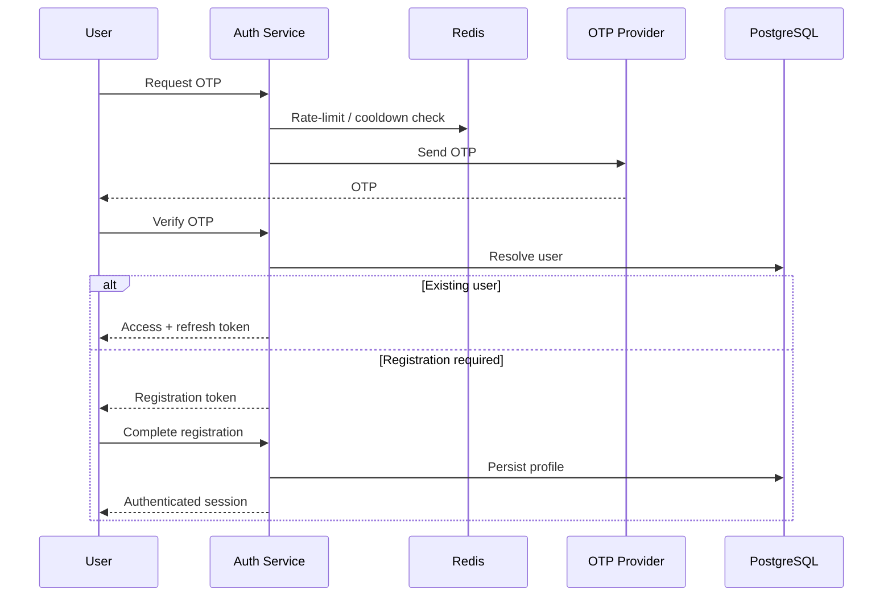

# Authentication Architecture

Authentication is centralized in the Auth Service.

The system supports public users, chefs, admins, and managers through OTP-based authentication, JWT access tokens, refresh tokens, and internal service authentication.

## Public Authentication



## Roles

Public roles:

```text
client
chef
```

Administrative roles:

```text
admin
manager
```

## JWT

Auth issues access tokens consumed by backend services.

Services that validate these tokens use the shared JWT configuration provided through their environment.

## Refresh Tokens

Refresh-token lifecycle is owned by Auth.

Public and administrative authentication have separate route namespaces.

## Internal Auth API

Backend services can communicate with Auth through protected internal endpoints for operations such as:

- token verification;
- profile resolution;
- user lookup.

Internal calls use a shared internal API key.

## Cross-Service Identity

Auth remains the source of truth for identity and profile information.

Services such as Chat can store identity references while resolving current display information from Auth when necessary.
