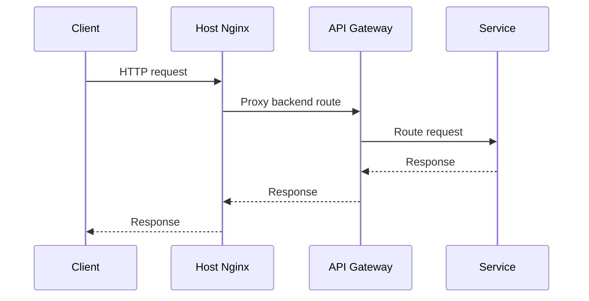
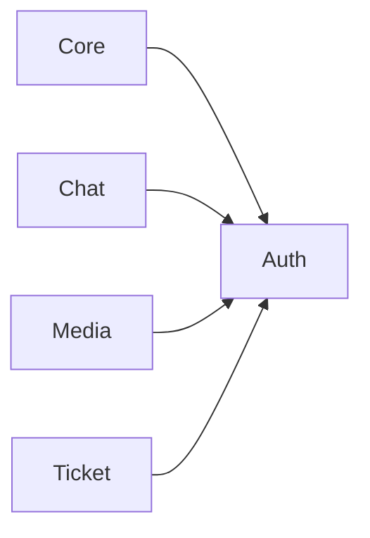
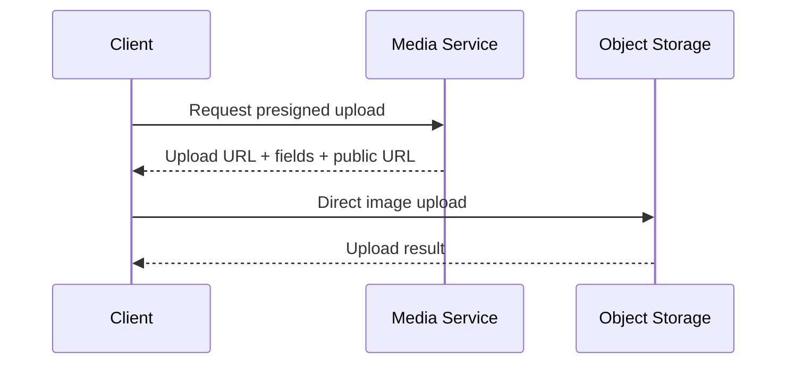

# Service Communication

Digche uses HTTP for synchronous service-to-service communication and WebSocket for realtime chat delivery.

## Public Request Flow



## Internal Auth Communication

Core, Chat, Media, and Ticket depend on identity owned by Auth.



These calls use protected internal Auth endpoints and an internal API key.

## Chat

Chat supports REST for conversation/history operations and WebSocket for realtime communication.

```text
Client -> Nginx -> Gateway -> Chat Service
```

Both proxy layers must preserve WebSocket upgrade headers.

## Media

The Media Service creates presigned upload information.

The client then uploads directly to object storage:



## Data Ownership

Cross-service communication should use service APIs rather than direct database access.

The service that owns a domain remains the authoritative source for that domain's data.
