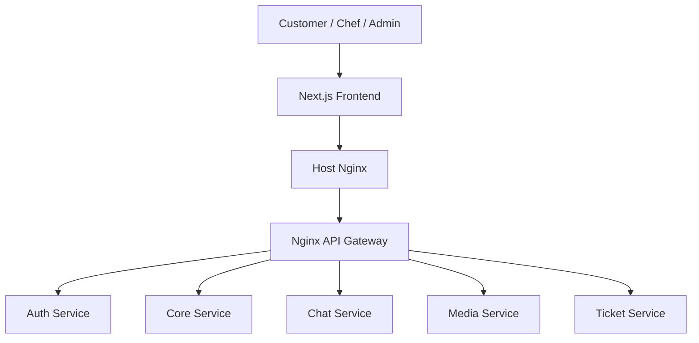
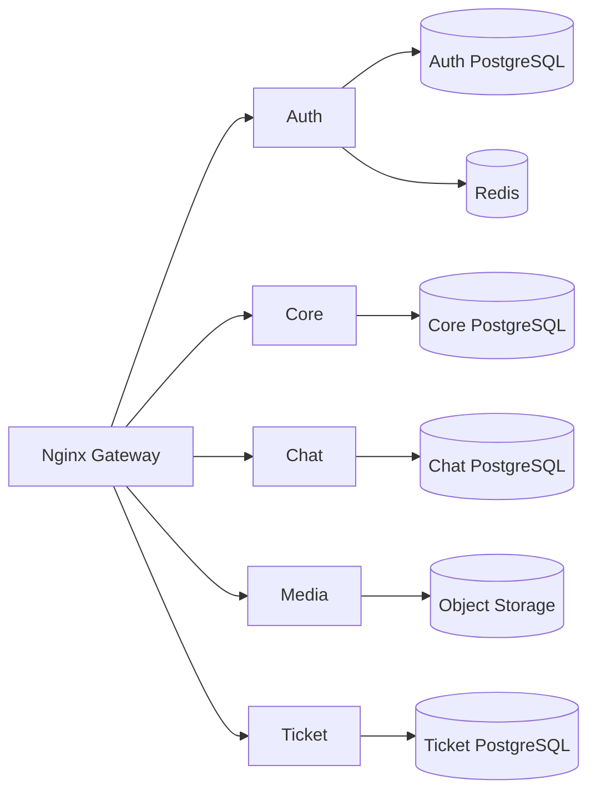

# Architecture Overview

Digche uses a microservices-based backend behind an Nginx API gateway, with a Next.js frontend as the main web client.

The backend separates authentication, marketplace business logic, chat, media upload orchestration, and support tickets into independent services.

## System Context



## Backend Services



## Service Responsibilities

### Auth

Owns authentication and identity concerns:

- OTP authentication;
- registration;
- access and refresh tokens;
- roles;
- user profile data;
- administrative authentication;
- internal token verification and profile resolution.

### Core

Owns the main food-ordering domain:

- dishes;
- carts;
- orders;
- comments;
- chef dashboard data.

The Core Service is implemented in .NET 9 and uses separate Domain, Application, Infrastructure, and API projects.

Its internal design follows a layered, Clean Architecture-inspired structure with MediatR-based commands and queries.

See [Core Service](../services/core.md).

### Chat

Owns:

- conversations;
- participants;
- messages;
- unread state;
- realtime WebSocket events.

### Media

Owns presigned upload creation for profile and dish images.

The client uploads image binaries directly to S3-compatible object storage.

### Ticket

Owns the support-ticket workflow between users and administrative users.

## Data Ownership

Each stateful service owns its persistence layer:

| Service | Persistence |
| --- | --- |
| Auth | PostgreSQL + Redis |
| Core | PostgreSQL |
| Chat | PostgreSQL |
| Ticket | PostgreSQL |
| Media | S3-compatible object storage |

Services communicate through APIs instead of directly reading another service's database.

## Gateway

The backend Nginx gateway is responsible for:

- public route mapping;
- upstream proxying;
- rate limiting;
- forwarding headers;
- WebSocket upgrade handling.

Local gateway:

```text
http://localhost:8081
```

Main route families:

```text
/auth/*
/admin/auth/*
/admin/admin-users*
/admin/chefs*
/media/*
/chat/*
/tickets*
/core/*
```

## Authentication

Auth issues JWT access tokens.

Other backend services validate Auth-issued identities locally and/or communicate with Auth through protected internal endpoints.

See [Authentication Architecture](authentication.md).

## Frontend

The frontend uses Next.js App Router and separates major user areas:

```text
src/app/
├── (public)/
├── (customer)/
├── (chef)/
├── (admin)/
├── admin-login/
└── api/chat/[...path]/
```

Feature code is organized under `src/features/`, while shared API, UI, provider, and utility code lives under `src/shared/`.

## Deployment Shape

Production uses:

```text
Internet
   |
Host Nginx
   |
   +---- Next.js frontend
   |
   +---- Dockerized backend gateway
              |
              +---- Auth
              +---- Core
              +---- Chat
              +---- Media
              +---- Ticket
```

See [Deployment Overview](../deployment/overview.md).
