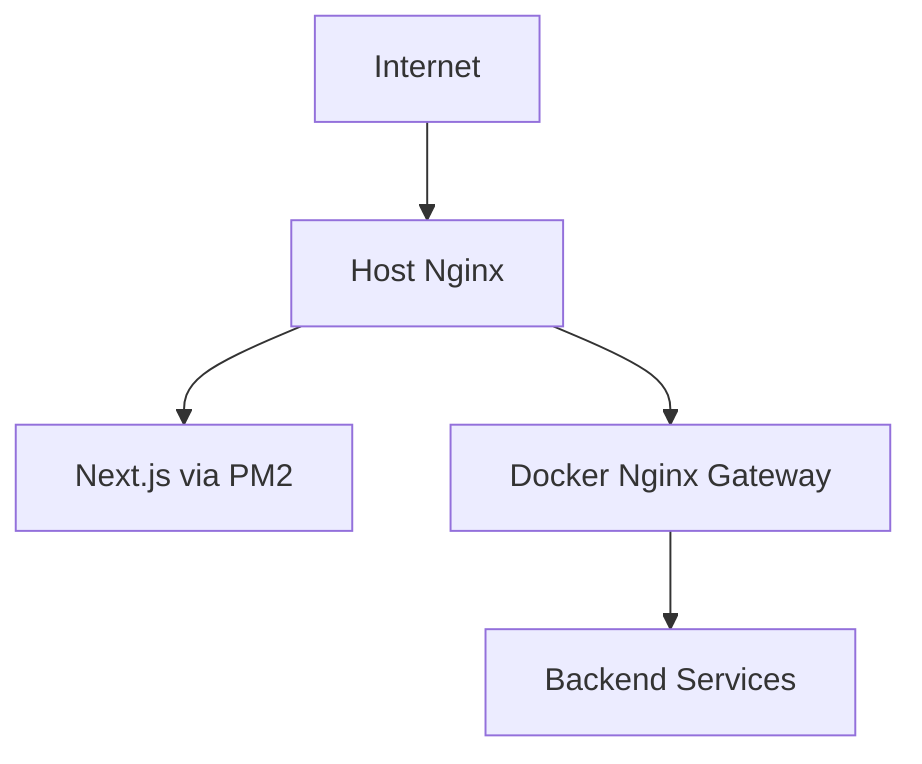

# Deployment Overview

Digche deploys the frontend and backend on a server using:

- Docker Compose for backend services;
- PM2 for the Next.js frontend;
- host Nginx as the public reverse proxy;
- GitHub Actions for production deployment.

## Topology



The backend gateway is bound to the host and is intended to sit behind host Nginx.

## Deployment Workflow

The repository contains:

```text
.github/workflows/deploy-production.yml
```

At a high level, the workflow:

1. creates a deployment archive;
2. uploads it to the production server;
3. restores server-side environment files;
4. rebuilds/restarts the backend;
5. builds/restarts the frontend;
6. reloads Nginx;
7. runs health checks.

See [Production Deployment](production.md).
