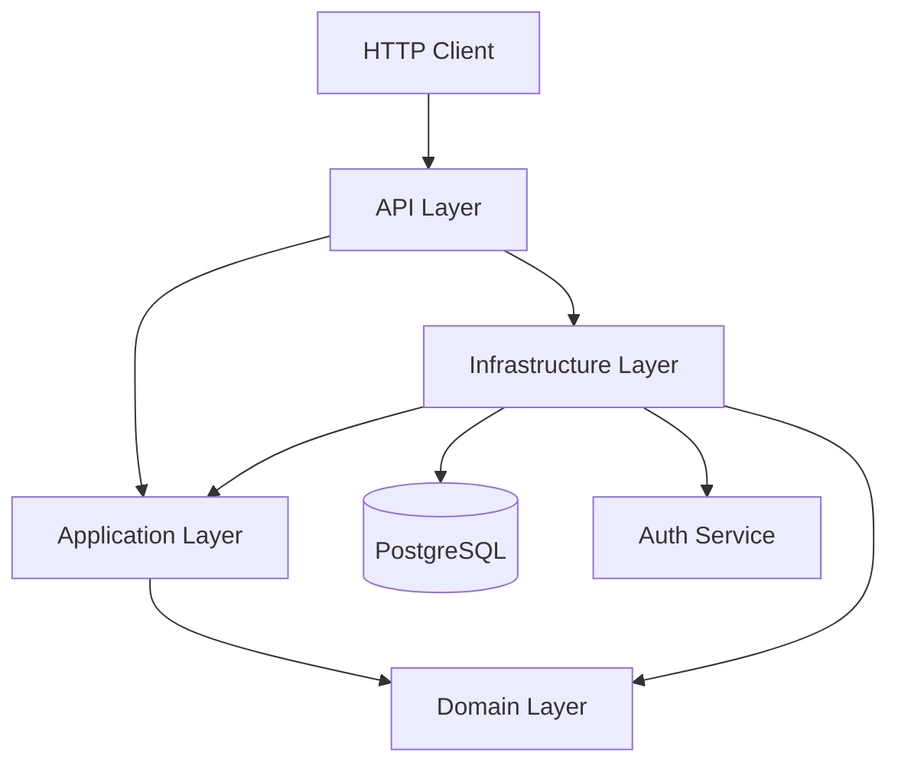
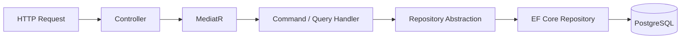

# Core Service

Path:

```text
Backend/services/core/FoodOrdering
```

The Core Service contains the main food-ordering business domain of Digche.

It was also the primary area of my contribution to the project.

## Responsibilities

Core owns:

- dish management;
- dish availability;
- shopping carts;
- order creation and order history;
- chef and customer order flows;
- order status handling;
- comments;
- chef dashboard data.

## Technology

- .NET 9
- ASP.NET Core
- MediatR
- Entity Framework Core
- PostgreSQL
- JWT Bearer authentication
- Swagger / OpenAPI in Development

## Solution Structure

```text
FoodOrdering/
├── FoodOrdering.Core.API/
├── FoodOrdering.Core.Application/
├── FoodOrdering.Core.Domain/
├── FoodOrdering.Core.Infrastructure/
├── FoodOrdering.Core.Tests/
└── FoodOrdering.Core.sln
```

## Internal Architecture

The service follows a layered, Clean Architecture-inspired structure.



### Domain Layer

The Domain project contains business entities, enums, and abstractions.

Main entities include:

```text
Dish
Cart
CartItem
Order
OrderItem
Comment
```

Repository and service interfaces are defined around the domain so application use cases do not depend directly on concrete persistence implementations.

### Application Layer

The Application project implements use cases through MediatR commands, queries, and handlers.

Examples:

```text
Commands
├── AddDish
├── UpdateDish
├── DeleteDish
├── AddToCart
├── RemoveFromCart
├── ClearCart
├── CreateOrder
├── UpdateOrderStatus
└── AddComment

Queries
├── GetDishById
├── GetAvailableDishes
├── GetChefDishes
├── GetCart
├── GetOrderById
├── GetCustomerOrders
├── GetChefOrders
├── GetDishComments
└── GetChefDashboardSummary
```

The layer also contains DTOs and shared result handling used by API-facing flows.

### Infrastructure Layer

Infrastructure contains technical implementations required by the application:

- EF Core `DbContext`;
- PostgreSQL repositories;
- database migrations;
- current-user resolution;
- communication with the Auth Service.

### API Layer

The API project contains:

- ASP.NET Core controllers;
- authentication and authorization configuration;
- dependency injection;
- health checks;
- Swagger configuration;
- application startup.

Main controllers cover:

```text
Dishes
Cart
Orders
Comments
Chef Dashboard
```

## Typical Request Flow



This separation keeps HTTP concerns, application use cases, domain models, and persistence responsibilities distinct.

## Persistence

Core owns its PostgreSQL database:

```text
core_db
```

Entity Framework Core is used for data access and migrations.

## Auth Integration

Core consumes authentication information issued by the Auth Service.

It also contains an internal Auth client used when Core needs user information owned by Auth.

## Public Gateway Prefix

Core is exposed through:

```text
/core/*
```

The gateway maps the public Core prefix to the service's internal API routes.

## Main API Areas

### Dishes

Supports:

- creating dishes;
- retrieving a dish;
- listing available dishes;
- listing a chef's dishes;
- updating dishes;
- deleting dishes.

### Cart

Supports:

- reading the current cart;
- adding items;
- removing items;
- clearing the cart.

### Orders

Supports:

- order creation;
- order lookup;
- customer order history;
- chef order history;
- order status updates.

### Comments

Supports:

- adding comments;
- listing comments for a dish.

### Chef Dashboard

Provides aggregated data used by the chef dashboard.

## My Work in Core

My main contribution to Digche was the design and implementation of the Core Service, including:

- domain entities and repository contracts;
- commands, queries, handlers, and DTOs;
- dish, cart, order, comment, and dashboard use cases;
- EF Core persistence and repository implementations;
- database migrations;
- ASP.NET Core controllers;
- Auth Service integration;
- Core service configuration and Docker setup.

The original Git history is preserved so the implementation history and team contributions remain visible.

## Tests

The solution contains the xUnit test project scaffold:

```text
FoodOrdering.Core.Tests
```

Build the solution with:

```bash
cd Backend/services/core/FoodOrdering
dotnet build
```
