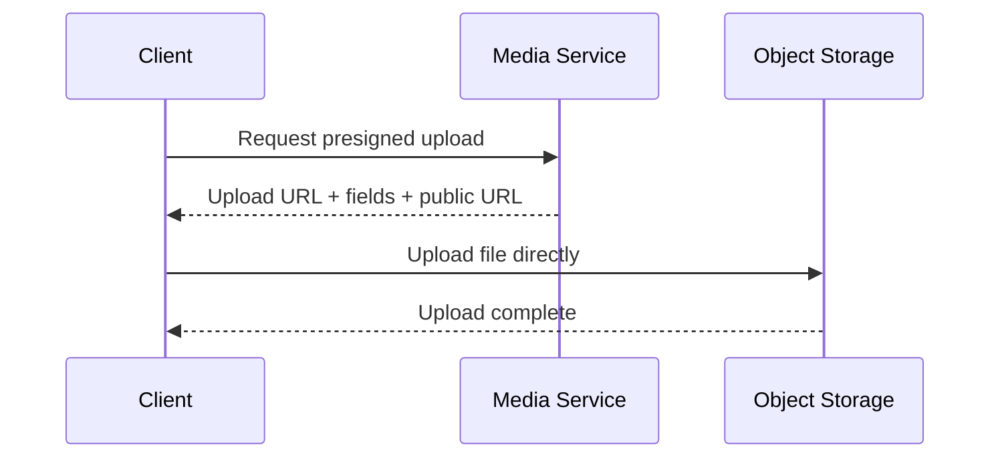

# Media Service

Path:

```text
Backend/services/media
```

## Responsibility

Media creates presigned upload requests for user and dish images.

The service validates the request and returns information that allows the client to upload directly to S3-compatible object storage.

## Technology

- Node.js
- Express
- AWS S3 SDK
- JWT
- OpenAPI / Swagger

## Storage

Media does not own a relational database.

Image files are stored in S3-compatible object storage.

## Upload Flow



## Main API Areas

```text
/media/profile-photo/presign
/media/dish-images/presign
```

## Documentation

OpenAPI source:

```text
Backend/docs/api/media.openapi.yaml
```
